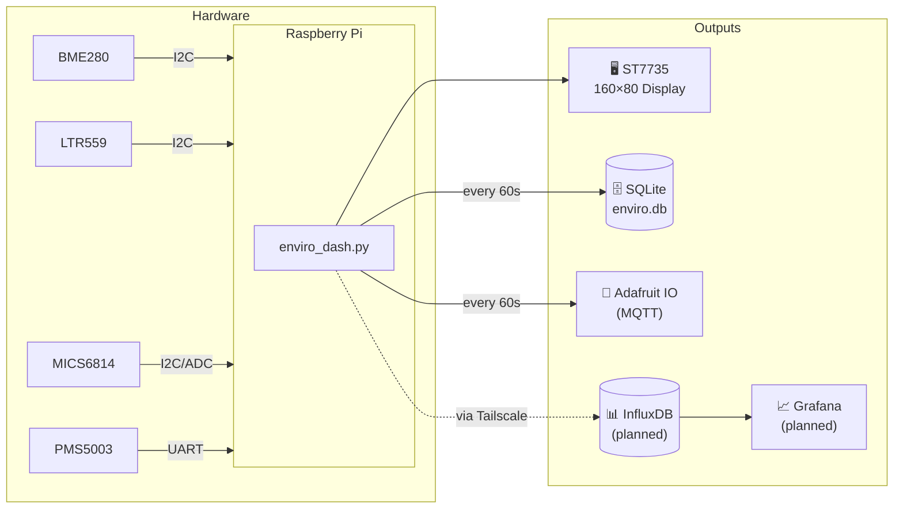

# 🌡️ Enviro+ Dashboard

A high-density, real-time air quality and environment monitor running on a Raspberry Pi with a [Pimoroni Enviro+](https://github.com/pimoroni/enviroplus-python) HAT. All 10 sensors displayed on a 160×80 ST7735 screen with color-coded bars, sparklines, and persistent SQLite logging.

---

## 🖥️ Display Layout

```
┌────────────────────────────────────────────────────────────────┐
│ ENVIRO+                                              9:45 PM   │  ← header
├────────────────────────────────────────────────────────────────┤
│ 🌡 72.3°F  ▓▓▓▓▓▓▓▓░░░░░░░   💧 H:49%  ▓▓▓▓▓░░░░░░░░░░░░   │  ← weather row
├────────────────────────────────────────────────────────────────┤
│ ☁  Ox:47k  ▓▓▓▓░░░  Rd:120k ░░░░░░░░  N3:158k ░░░░░░░░░░░   │  ← gas row
├────────────────────────────────────────────────────────────────┤
│ · ·PM1:2   ▓░░░░░░  2.5:3   ▓░░░░░░░  PM10:4  ▓░░░░░░░░░░   │  ← particulates
├────────────────────────────────────────────────────────────────┤
│ ☀ Lux:142   P:1013                              ┌ GOOD ┐       │  ← light + AQ
├──────────────────────────────┬─────────────────────────────────┤
│ T°F  ················        │ PM2.5  ·····················    │  ← sparklines
└──────────────────────────────┴─────────────────────────────────┘
```

**Color coding:**

| Color | Meaning |
|-------|---------|
| 🟢 Green | Normal / safe |
| 🟡 Yellow | Elevated / watch |
| 🟠 Orange | High / caution |
| 🔴 Red | Dangerous |
| 🟣 Magenta | Hazardous (PM2.5 > 150) |

---

## 🔬 Sensors

| Sensor | Chip | Measures | Notes |
|--------|------|----------|-------|
| Temperature | BME280 | °F (CPU-compensated) | CPU heat correction via `CAL_ACTUAL_F` |
| Humidity | BME280 | % RH | |
| Pressure | BME280 | hPa | |
| Light | LTR559 | Lux | Also used as proximity sensor |
| Oxidising gas | MICS6814 | kΩ (NO₂, O₃) | Higher resistance = cleaner air |
| Reducing gas | MICS6814 | kΩ (CO, VOCs) | Lower resistance = more pollution |
| Ammonia | MICS6814 | kΩ (NH₃) | Lower resistance = more pollution |
| PM1.0 | PMS5003 | µg/m³ | External particulate sensor |
| PM2.5 | PMS5003 | µg/m³ | Fine particles — primary AQI metric |
| PM10 | PMS5003 | µg/m³ | Coarse particles |

> 🔬 **Planned:** Adafruit SCD-41 breakout (CO₂, I2C 0x62) — no address conflict with existing sensors

---

## 🏗️ Architecture



---

## 📦 Hardware

| Component | Where to buy |
|-----------|-------------|
| [Pimoroni Enviro+](https://shop.pimoroni.com/products/enviro-plus) | Pimoroni |
| [PMS5003 Particulate Sensor](https://shop.pimoroni.com/products/pms5003-particulate-matter-sensor-with-cable) | Pimoroni |
| Raspberry Pi (3 B+, 4, 5, or Zero 2 W) | Various |
| [Adafruit SCD-41 CO₂ Sensor](https://www.adafruit.com/product/5190) | Adafruit *(planned)* |

---

## 🚀 Setup

### 1. Install Pimoroni libraries

```bash
git clone https://github.com/pimoroni/enviroplus-python
cd enviroplus-python
./install.sh
```

### 2. Clone this repo

```bash
git clone https://github.com/strommy76/enviroplus.git ~/projects/enviroplus
cd ~/projects/enviroplus
```

### 3. Install Python dependencies

```bash
pip install -r requirements.txt
```

### 4. Configure

```bash
cp .env.example .env   # then edit with your values
```

| Variable | Default | Description |
|----------|---------|-------------|
| `CAL_ACTUAL_F` | `0` | Known actual temp (°F) from a reference thermometer. Set `0` if sensor is physically separated from the Pi. |
| `MQTT_BROKER` | `io.adafruit.com` | MQTT broker hostname |
| `MQTT_USER` | | Adafruit IO username |
| `MQTT_KEY` | | Adafruit IO key |
| `MQTT_PUBLISH_INTERVAL` | `60` | Seconds between MQTT publishes |
| `SQLITE_PATH` | `enviro.db` | Path to SQLite database |
| `SQLITE_INTERVAL` | `60` | Seconds between SQLite writes |
| `LOG_PATH` | `enviro.log` | Rotating log file path |

### 5. Run as a systemd service

```bash
sudo cp enviro_dash.service /etc/systemd/system/
sudo systemctl daemon-reload
sudo systemctl enable --now enviro_dash
```

Check status:
```bash
sudo systemctl status enviro_dash
tail -f ~/projects/enviroplus/enviro.log
```

---

## 🌡️ CPU Temperature Compensation

The BME280 sits millimetres from the Pi's CPU and reads several degrees high. The script auto-derives a correction factor at startup using a reference reading:

```
CPU_FACTOR = (cpu_temp - raw_temp) / (raw_temp - actual_temp)
compensated = raw - (avg_cpu - raw) / CPU_FACTOR
```

Set `CAL_ACTUAL_F` in `.env` to your reference thermometer reading and restart. The log will confirm:

```
2026-03-15 21:45:52 INFO  CPU_FACTOR=1.42 (raw=99.1°F cpu=58.3°C actual=72.3°F)
```

> 💡 The Pi 5 with active cooling runs significantly cooler than the 3 B+, resulting in a much smaller correction factor.

---

## 🗄️ SQLite Schema

```sql
CREATE TABLE readings (
    ts        TEXT PRIMARY KEY,   -- local time: "2026-03-15 21:30:00"
    temp_f    REAL,
    humidity  REAL,
    pressure  REAL,
    lux       REAL,
    oxidising REAL,
    reducing  REAL,
    ammonia   REAL,
    pm1       REAL,
    pm25      REAL,
    pm10      REAL
);
```

Query example:
```sql
SELECT ts, temp_f, pm25 FROM readings
WHERE ts >= '2026-03-15 20:00:00'
ORDER BY ts DESC LIMIT 20;
```

---

## 📡 Live Dashboard

**Adafruit IO:** https://io.adafruit.com/strommy/dashboards/bsenviropi

---

## 🔗 Upstream Sources

| Resource | Link |
|----------|------|
| Pimoroni Enviro+ Python library | https://github.com/pimoroni/enviroplus-python |
| PMS5003 Python library | https://github.com/pimoroni/pms5003-python |
| LTR559 Python library | https://github.com/pimoroni/ltr559-python |
| Pimoroni Enviro+ product page | https://shop.pimoroni.com/products/enviro-plus |
| Pimoroni learning: Enviro+ | https://learn.pimoroni.com/article/getting-started-with-enviro-plus |
| MICS6814 datasheet | https://www.sgxsensortech.com/content/uploads/2015/02/1143_Datasheet-MiCS-6814-rev-8.pdf |
| PMS5003 datasheet | https://www.aqmd.gov/docs/default-source/aq-spec/resources-page/plantower-pms5003-manual_v2-3.pdf |
| Adafruit SCD-41 guide | https://learn.adafruit.com/adafruit-scd-40-and-scd-41 |

---

## 📋 Roadmap

- [x] 10-sensor dashboard on ST7735 display
- [x] CPU temperature compensation
- [x] MQTT publish to Adafruit IO
- [x] SQLite logging with local timestamps
- [x] Rotating log file
- [x] systemd service with auto-restart
- [ ] Adafruit SCD-41 CO₂ sensor integration
- [ ] InfluxDB writer (stub in code, pending Docker setup)
- [ ] Grafana dashboard on AI host via Tailscale
- [ ] Migrate to Raspberry Pi 5
